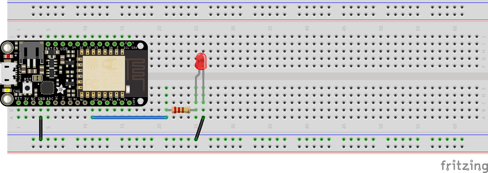

# that-conference-2017
Code samples for That Conference Robotics / IoT Lab 2017

## Johnny Five

Johnny Five is a Node JS library that can be used to communicate with IoT boards running the Firmata sketch.  In these examples, we'll be using the Adafruit Feather HUZZAH board, which is a Firmata compatible board which can be attached to via WiFi.

### Prepping the environment

1. Open the NodeJS command prompt (on windows) or the terminal (on Linux).
2. Change to the directory you want to use for coding
3. Load the johnny-five node module
    ```
    npm install johnny-five
    ```
4. When this completes, you should be ready to go!

### Determine the board IP address
<a name="NetworkAddress"></a>

1. Open Arduino studio and choose 'Tools -> Serial Monitor'
2. This will open a 'terminal' window that shows the output from the serial port on the board.  Find the IP address that the board is using, as you'll need it to communicate with the board.  In the screenshot below, the IP address is '192.168.192.117'.

    

## Create your first project

You should have received a long breadboard with attached Feather HUZZAH as part of the materials for this lab.  The board should look like this:


Find a single (non-RGB) led of your choice, a 220Ω resistor and three wires, then setup your board to look like the following picture:



The 'longer' leg of the LED should be connected to the resistor, and the shorter leg should be connected to the ground plane.

### Create the NodeJS file

Open your code editor (Visual Studio Code or Geany) and create a new file in the same directory that you installed the johnny-five module.  We'll call it 'blinky.js'.  The add the following lines of code:

```javascript
    var five = require('johnny-five');

    var board = new five.Board({

    });

    board.on("ready", function() {
        console.log("READY!");
    });
```

This will be the basic format of most Johnny-Five scripts.  It works like this:

1.  The initial 'five' object is created, which imports the module
2.  The board object is created, which connects to the firmata capable board
    * NOTE: The default is to connect to an automatically detected COM port
3.  We setup some 'future work' to be executed when the board connection has been made and the board is ready

### Setup to communicate via WiFi

In our case, we don't want to connect via a serial connection, we want to connect over a network.  Find the address for the Feather board that you [wrote down earlier](#NetworkAddress).  Then update the code to specify you want to connect via the network (replace the [[address]] text with the address of the feather).

```javascript
var EtherPortClient = require('etherport-client').EtherPortClient;
var board = new five.Board({
    port: new EtherPortClient({
        host: "[[address]]",
        port: 3030
    }),
    timeout: 1e5,
    repl: false
});
```

## Test the program

Now, from the command line / terminal, type:

```
node blinky.js
```

This should give you output that indicates the Johnny-Five library is connecting to the board, and it should print 'READY!' to the console.  Once that happens, hit 'Ctrl+C' to kill the program and return to the command prompt.  Now it's time to make the light blink!

### Make the LED blink

Johnny-Five uses special classes (blocks of code that describe something) to interact with the various components of the Feather.  In this case, we're going to use the Led class to interact with the LED on our breadboard.  Update the 'ready' event to look like this:

```javascript
board.on("ready", function() {
    console.log("READY!");
    var led = new five.Led(14);
    led.blink(500);

    this.on("exit", function() {
        led.off();
    });
});
```

This code tells the J-Five library that there is an LED connected to pin #14 on the board.  Then is asks the LED to blink every 500 milliseconds (2x per second).  Then it asks the board to turn off the LED when the 'exit' event occurs.

## Test the program

Now, again from the command prompt / terminal, type:

```
node blinky.js
```

Now, you should see J-Five connect to the board, and then shortly afterwards the LED starts blinking.  When you hit 'Ctrl+C', the LED should turn off and the program should exit.

### Fancier blinking

Most of the pins on the Feather support something called Pulse-Width Modulation (PWM).  This is a fancy way of saying 'turn on and off really fast', but the end result is that it works kind of like a dimmer switch in your house.  To test this out, change the code inside the 'ready' event to look something like this:

```javascript
board.on("ready", function() {
    this.pinMode(14, five.Pin.PWM);

    var led = five.Led(14);

    led.pulse({
        easing: "linear",
        duration: 1000,
        cuePoints: [0, 0.2, 0.4, 0.6, 0.8, 1],
        keyFrames: [0, 250, 25, 150, 100, 125],
    });

    this.wait(1000, function() {
        led.pulse();
    });

    this.on("exit", function() {
        led.off();
    });
});
```

We won't cover in detail what the code above does, but at a high level the code asks J-Five to 'animate' the LED blinking with a linear rise and fall.  This means that the LED will smoothly turn on and off, rather than sharply blinking.  There are lots of animation options available, if you're interested, head on out to johnny-five.io and check out all the options.  Go ahead and run the code again to see it in action!

## Fun with a Micro-Servo

Now that we've got basic communication and the ability to blink an LED, let's move on to a slightly more complicated circuit.  You can take the existing components off the board, or you can leave them in place.  The diagrams will assume that you've taken the components off the board, so you may need to find alternate paths for wires if you choose to leave the LED connected.

### Laying the Base Planes

We'll start by setting up our 'base planes'.  This project uses 3 different voltages - 5V, 3.3V and 0V (Ground).  To make things easier to wire up later, we're going to leverage the 4 'outer' lanes of the breadboard.


The wires above are color coded in the diagram, but you don't need to use those colors in your project (you may not have them).  You should try to use the same color for the same 'voltage level', to help minimize confusion.

### Setting up the control knob

For this project, we'll use a Potentiometer (POT) to control the position of the Servo's arm.  We're using the POT as a 'voltage divider', turning the dial clockwise decreases output voltage.  Turning it counter-clockwise increases output voltage.  We'll measure this voltage to control where the servo arm is currently positioned (like a simple voltage meter).

In our case, the voltage we need to measure is hard-limited to approximately 0-1V (that's all the Feather can handle), so we need to do some additional voltage dividing ourselves (to send only ~1V through the POT).  Setup your circuit like the picture below:


Hook up the POT:
1.  Insert the POT near the top in the middle of the breadboard.  Make sure the 3 pins are in 3 different vertical lanes.  Adjust the dial so the arrow is pointing up (off the board).
2.  Then, from left to right, place the 10kΩ, 5.1kΩ, 3kΩ and 1kΩ resistors.
3.  You can either plug the 10kΩ resistor into the 3.3V plane directly, or use a short wire to connect it as the picture shows.
4.  Similarly with the 1kΩ resistor, you can plug it directly to ground, or use a wire.
5.  Run a wire from the 'ADC' pin on the Feather to the center pin of the POT
6.  Run a wire from the same column where the 10kΩ and 5.1kΩ resistors connect into the left-hand pin of the POT
7.  Run a wire from the Ground (0V) plane to the right-hand pin of the POT.

## Test the POT

Now, open your favorite text editor and create a file called 'servo-control.js'.  Insert the following into the file (again, [[address]] is the IP address of the Feather):

```javascript
var five = require('johnny-five');
var EtherPortClient = require('etherport-client').EtherPortClient;

var board = new five.Board({
    port: new EtherPortClient({
        host: "[[address]]",
        port: 3030
    }),
    timeout: 1e5,
    repl: false
});

board.on("ready", function() {
    console.log('Board is ready!');

  var control = new five.Sensor({
      pin: "A0",
      freq: 250
  });

  control.on("data", function() {
    console.log('Value: ', this.value, ', Raw: ', this.raw);
  });

});
```

Jumping over to the command prompt / terminal and running your program (<code>node servo-control.js</code>) should result in a continuous stream of readings flowing through.  Watch what happens to the values as you turn the POT.  You should see that the values range somewhere between 0 -> 800 (a perfect conversion would be 0 -> 1024).

### Add the Servo

Finally, let's add the servo to the mix.  We're also going to add an inline switch that can be used to cut power to the servo, since it sometimes wants to continue 'humming' even when the program isn't actively running.  Wire up the switch and servo to look like the following:


Now, update the program to add the following lines:

```javascript
board.on("ready", function() {

// ... existing sensor code

  var servo = new five.Servo({
    pin: 2,
    startAt: 90,
    range: [0, 180],
    debug: true
  });

  control.on("change", function() {
      var controlValue = this.scaleTo(0, 180);
      servo.to(controlValue);
  });

});
```
These new lines ask the J-Five library to setup a Servo running from pin #2 on the Feather.  Since the servo we're using has a limited angle range of 0-180, we need to scale the input of our sensor (0-800) to that range.  If you run your program, you should now see that the servo follows the position of the POT dial (more or less).

### Other Servo Control options

In addition to using the POT input to control the servo, you can also 'sweep' the servo using the J-Five library, example control code looks like:

```javascript
  console.log('Servo connected');
  
  var lap = 0;

  servo.sweep().on("sweep:full", function() {
    console.log("lap", ++lap);

    if (lap === 1) {
      this.sweep({
        range: [40, 140],
        step: 10
      });
    }

    if (lap === 2) {
      this.sweep({
        range: [60, 120],
        step: 5
      });
    }

    if (lap === 3) {
      this.sweep({
        range: [80, 100],
        step: 1
      });
    }

    if (lap === 5) {
      process.exit(0);
    }
  });

  this.on("exit", function() {
      servo.to(90);
  });
```

This will cause the servo to 'sweep' back and forth continuously (for 5 'laps').  For more ideas, you can explore the Servo class documentation at johnny-five.io.

# Congratulations!

You've done!  For further exploration, think about how you could combine the servo with one (or more) LEDs, add additional hardware sensors / displays, etc.  When you're done, bring your materials to the check-in desk and explore other areas of the lab!


