# that-conference-2017
Code samples for That Conference Robotics / IoT Lab 2017

## Pi Zero and Node-RED

In this lab, we'll use Node-RED to manipulate an LED attached to a Pi Zero W computer.  Node-RED is a drag-and-drop workflow editor that runs on the Pi and can interface with the hardware on the device.  We'll create a simple web server to tell the attached RGB led to show a color on the LED by specifying the red, green and blue components of the color.  We'll be somewhat limited by the capabilities of our particular LED, as it doesn't provide perfect blending, but we should see the results of our request show up on the Raspberry Pi.

### Setting up the Pi

We'll start by setting up the hardware side of things.  Take your components and wire them up as shown in the following diagram.

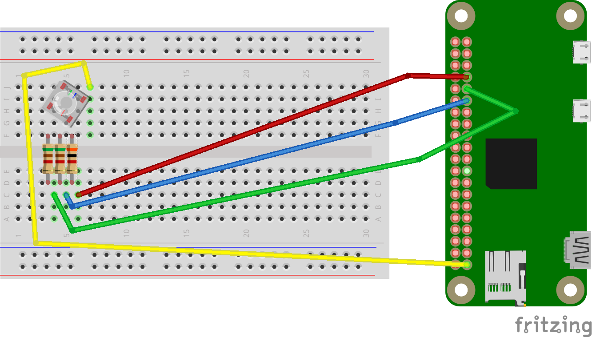

Wires (See Pi Pinout Chart):
* Yellow - to 3.3V supply pin
* Green - to GPIO6
* Red - to GPIO13
* Blue - to GPIO5

Resistors:
* 3kΩ (green, brown, red, gold) - inline with the blue and green wires
* 5.1kΩ (orange, black, red, gold) - inline with the red wire

### Connecting to Node-RED

Look at your Pi Zero, there should be a label with the IP address of the computer.  Open a web browser to that address (192.168.192.111 in this example).

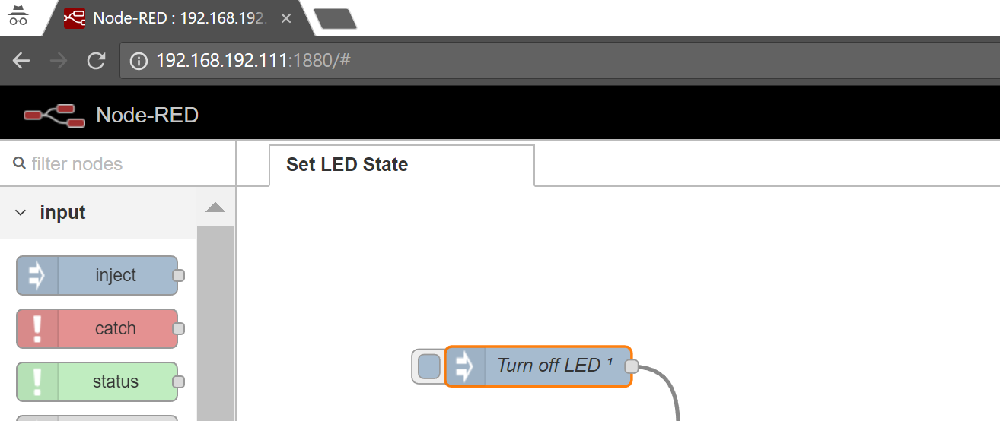

On the left of the screen, you'll find the available 'nodes' for things like input, output, interacting with the Pi, etc.  The center of the screen has the 'flows' that are currently available on the Pi Zero.  The right-hand side (not pictured) has information about the currently selected node in the current flow.  Dragging a node from the left into the center panel adds the node to the flow, and click-dragging from an 'output circle' on the right of a node to an 'input circle' on the left of a node provides a connection between two nodes.  Double-clicking on a node brings up the properties of the node and let's you change things about it.

## Starting your flow

To begin, find an 'Inject' input node and drag it into the flow.  Double click on the node and set up the properties to look like this:

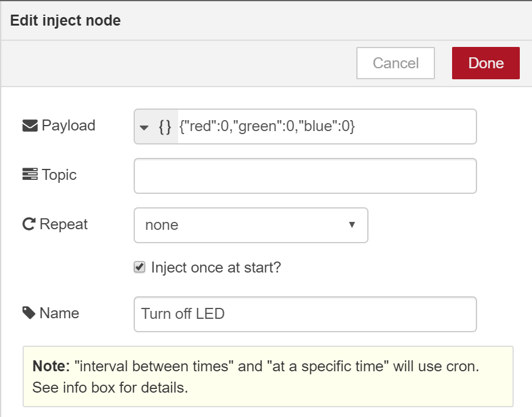

This will provide a sample input into your flow, in this case, it just tells the system to start with the LED turned off, but we'll change this during initial testing phases.  Hiding behind the '{}' in the Payload selection is the 'JSON' option.  JSON is an abbreviation for JavaScript Object Notation, and it's how we'll send information into the flow when we connect to it later.

### Splitting the colors

Our RGB LED is controlled via 3 different GPIO pins on the Pi, so we need to split our single input into 3 distinct outputs, one for each RGB component.  There are lots of ways to do this in NodeRED and in this example, we're going to use some simple JavaScript to do the job.

Drag a 'function' function node onto your flow, and set it up to look like this:

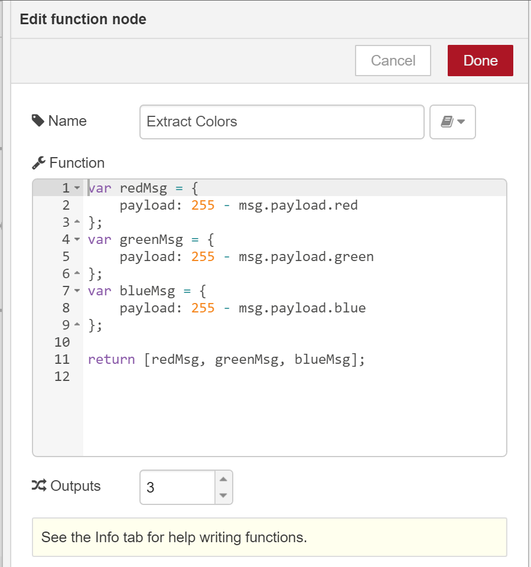

The 'function' node lets us write a little bit of JavaScript to manipulate the data as it flows through the node.  In this case, we want to take a 'payload' (contents) of the incoming message and split it out into 3 different messages, each with a payload of just one of the color values.  For each color value, we're 'inverting' the passed in value, due to how the interaction with the Pi works (this will be explained later).  

This 'message passing with a payload' is how all NodeRED interactions work, the current node does 'something' with a message, and then a new message is created to send to the next node(s) in the flow.  In this particular instance, we want to take one message and produce 3 messages, so we use a JavaScript array [] to return our result.  When we click 'Done' you'll notice that your function node now has 3 right-hand output circles, each output circle corresponds to one of the messages we sent from the function.

### Sending to the Pi

Now that we can take an input message and split it into 3 color messages, we want to actually send those color messages to the Raspberry Pi Zero.  To so that, we'll use some of the special 'rpi gpio' nodes (these are near the bottom of the left-hand column).  You'll want to be sure to grab the node which has a single left-hand input circle, since we want to send data out to the pin.  Drag one of these onto the right-hand side of your flow, then set it's properties to match this:

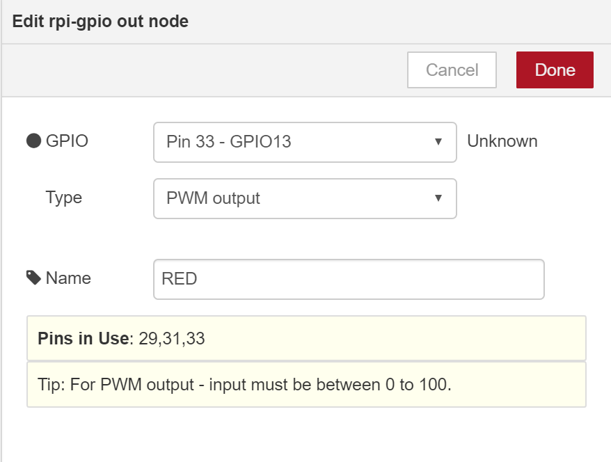

*Do this for two additional nodes (Green and Blue), mapping to the pins mentioned above (5 and 6).*

<blockquote>
As mentioned above, we need to invert the incoming values, the reason for this is that PWM values are between 0-100.  If you send a '0' to the pin, it turns the pin on all the time, and sending 100 turns the pin off all the time (with our setup).  Since we want a value of 255 to mean that the color is 'on', we need to make that value = 0, so we calculated it by subtracing (255 - 255 = 0).
</blockquote>

Now, let's start connecting things together.  Click-Drag from the output of the 'Turn off LED' node to the input of the 'Extract Colors' node.  Then connect the 3 output circles of 'Extract Colors' to the 'Red', 'Green' and 'Blue' input circles (remember, the colors go in order, from top->bottom).  The end result should look something like this:

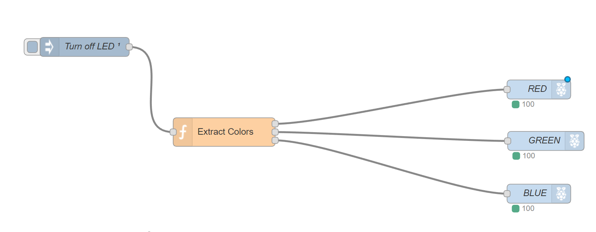

You may have noted that in GPIO setup screenshot above, it mentions that the value coming into the node should be between 0 and 100.  Normally, RGB colors are specified in the 0-255 range for each component, and it would be nice to stick to that standard.  To do this, we're going to add some automated scaling of the color values prior to sending them to the GPIO outputs.

Drag a 'range' function node and drop it on the line between the 'Extract Colors' and 'Red' nodes.  This should automatically insert the range node between the two.  Setup the properties to look like this:

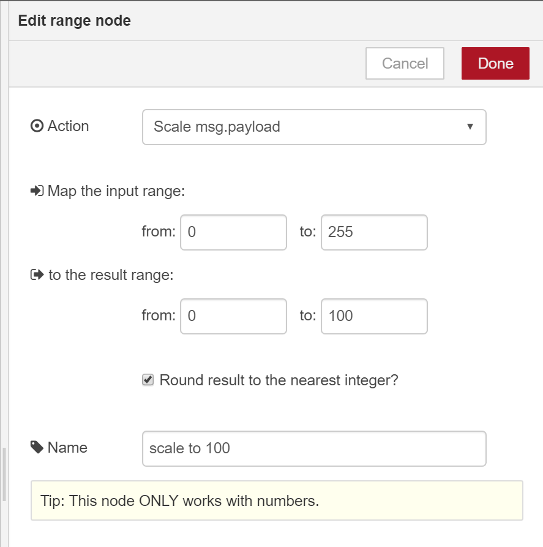

Hit 'Done', then click the node once to select it, then hit 'Ctrl+C' to copy the node.  This will 'activate' a new copied node and you can place it before the 'Green' and 'Blue' nodes without needing to retype all that information.

## Testing the setup

Now that we have a full flow, we can test it to see what happens.  Hit the 'Deploy' button on the upper right hand corner of the page, and your flow will be sent to the Pi for execution.  You won't see much right now (the LED should just turn off).  But once it says 'Successfully Deployed', you code is now running on the Pi.  To test it, let's temporarily change the 'Turn off LED' node to send in an actual color to display.  To test that everything is wired up properly, try testing once with (255, 0, 0) [Red], (0, 255, 0) [Green] and (0, 0, 255) [Blue].  Each time you make a change, hit the 'Deploy' button again to see the results of your changes.

Once you've verified that all your wiring is correct and the LED is behaving as desired, switch the 'Turn off LED' node back to all 0's.

### Adding the web server

To setup the Pi to accept an incoming web request, we need to drag an 'http' input node onto the flow.  Place this node below the 'Turn off LED' node from earlier, then double-click and edit the properties to match the ones below:

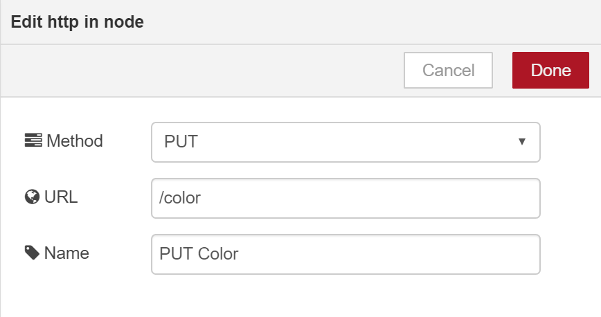

Now, HTTP input by itself will work, but it would be nice to tell the person making the request that what they did worked, so let's add a couple more nodes.  First we'll start with a template node, drag a 'template' function node onto the flow below the 'Extract Colors' node and set it up:

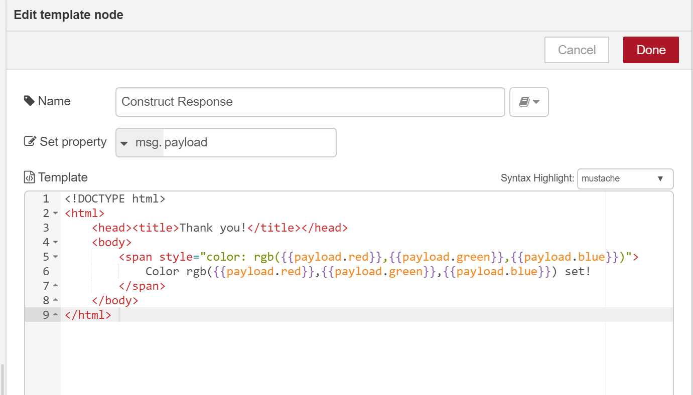

Once we have the template, we can send the response to the user, so drag an 'http' output node onto the flow below the 'Blue' node and name it 'Send Response'.  

### Final Wiring

Set up these connections:
* The output circle on the 'PUT Color' node should flow to the input circle on 'Extract Colors'
* The output circle on the 'PUT Color' node should flow to the input circle on 'Construct Response'
    * Inputs and outputs can be connected to multiple places, this causes the messages to be delivered to each place at the same time
* Connect the output of 'Construct Response' to the input of 'Send Response'.

Once you're done, your flow should look something like this:

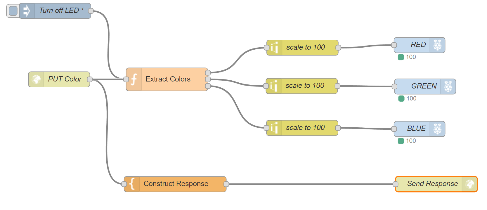

Now hit 'Deploy' and move on to testing!

## Testing the final result

On your laptop, you should have a program called 'Postman', we'll use this program to send data to the Pi Zero and change the color of LED.  Launch Postman and you should see a new tab come up for your request:

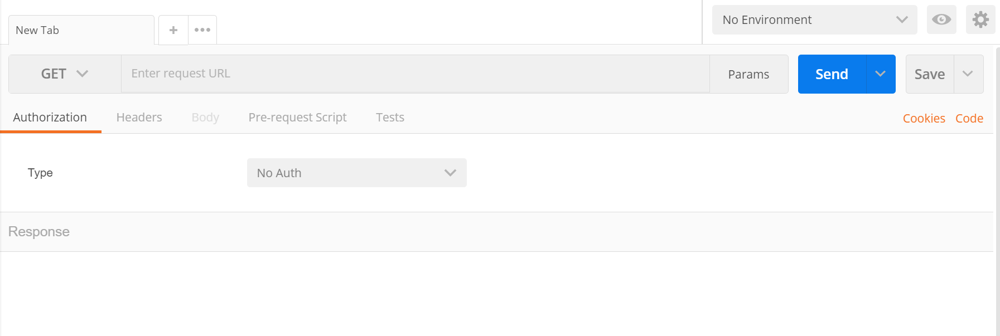

Change the dropdown to say 'PUT' and type the URL for your Pi:

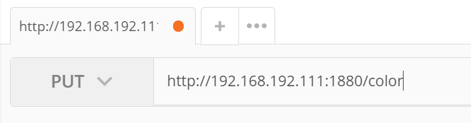

To tell the Pi that we're sending JSON, we need to add a Header:

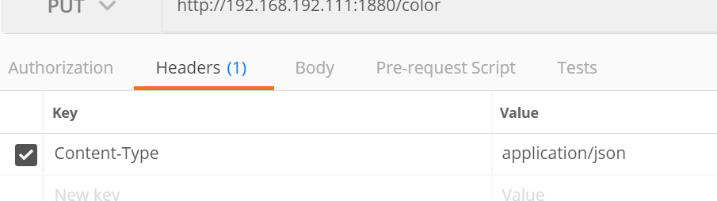

Then we need to add the body of the request to tell the Pi what color to show:

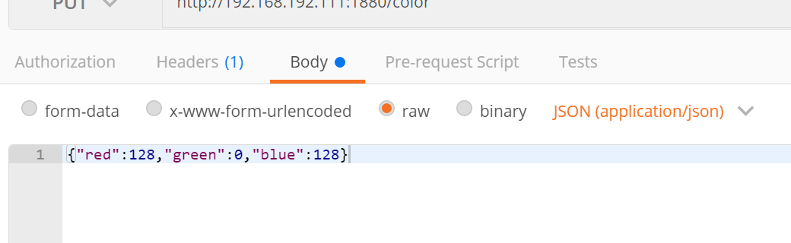

Finally, hit the 'Send' button and your Pi should show the color you requested, and the Postman window should look something like this:

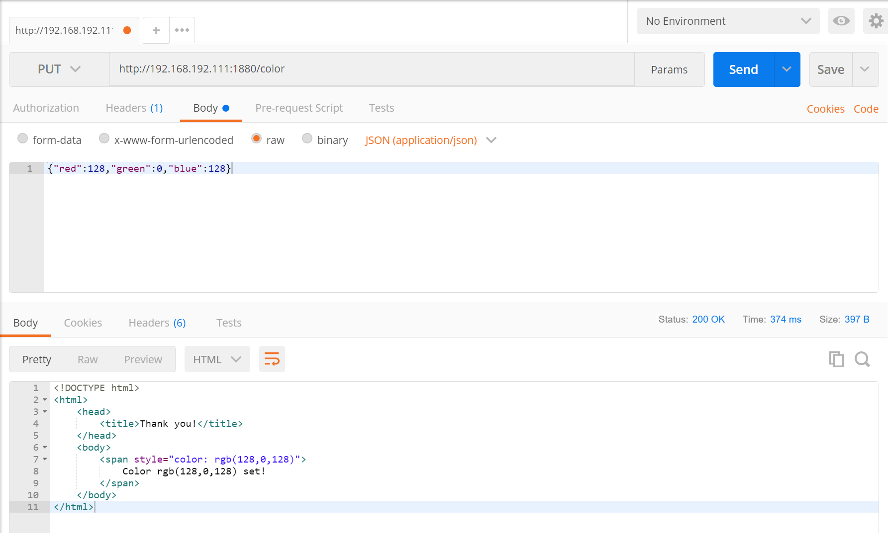

# Congratulations

You've completed this lab exercise, you can continue to experiment with NodeRED and sending different colors, or you can return the materials and try another of the activities in the lab!

